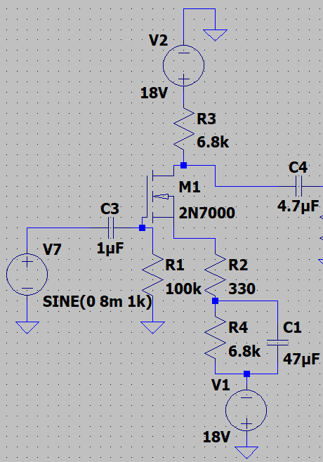
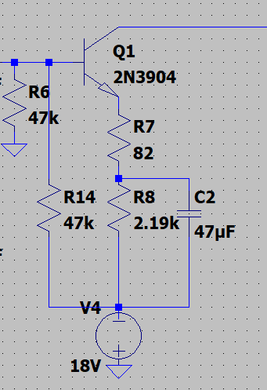
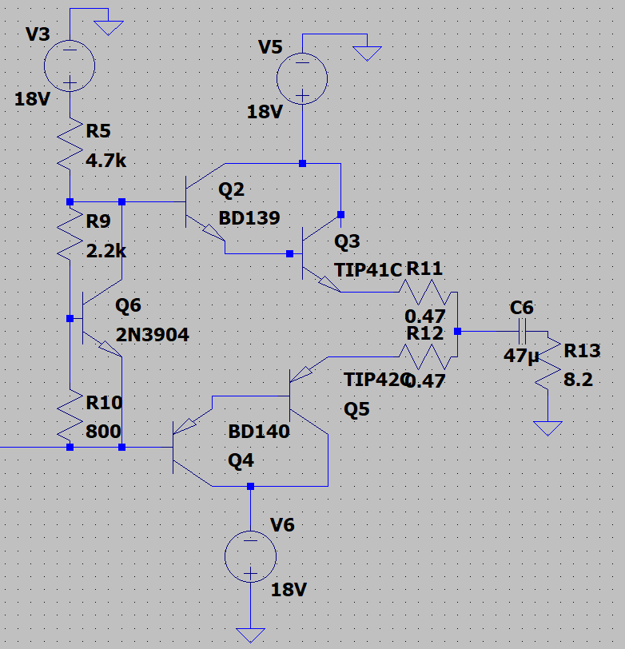
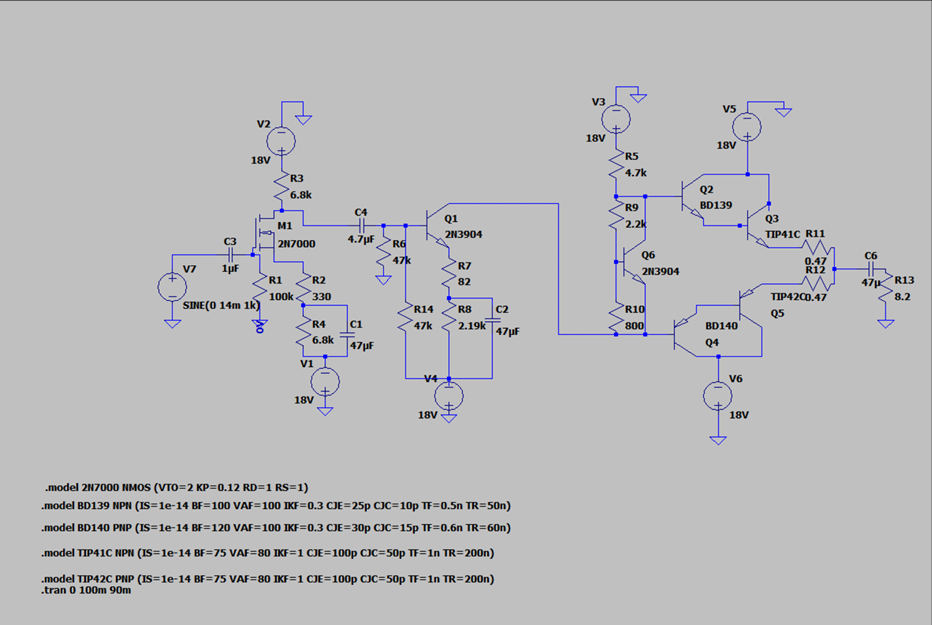
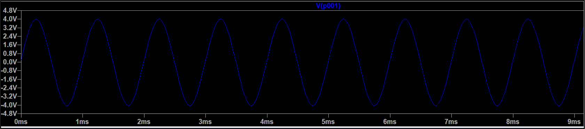

# Discrete-Audio-Amplifier-using-Transistors

A fully discrete multi-stage audio amplifier designed from scratch to amplify extremely low-level microphone signals into speaker-driving output power using only transistors, resistors, and capacitors — without integrated circuits (ICs) or operational amplifiers.

The amplifier was engineered to meet strict electrical specifications while demonstrating transistor-level analog circuit design, impedance matching, gain staging, and distortion minimization.

---

## Project Overview

This project was developed for an Electronic Circuit Design (ECD) course with the objective of designing a complete transistor-based audio amplifier capable of:

- Amplifying weak microphone signals
- Driving an **8Ω speaker**
- Achieving **500 V/V overall voltage gain**
- Maintaining controlled impedance requirements
- Producing clean output with minimal distortion

To deepen understanding of transistor physics and analog design, the use of ICs and Op-Amps was strictly prohibited.

---

## Key Specifications

| Requirement | Target |
|-------------|--------|
| Input Impedance | ≥ 100 kΩ |
| Pre-Amplifier Output Impedance | ≤ 5 kΩ |
| Overall Voltage Gain | 500 V/V |
| Frequency Response | 100 Hz – 12 kHz |
| Output Power | 1W – 3W into 8Ω |
| Supply Voltage | ±18V |

---

## Features

✔ Fully discrete transistor amplifier (No ICs)  
✔ MOSFET-based high input impedance preamp  
✔ BJT common-emitter voltage amplification stage  
✔ Class-AB Darlington output stage  
✔ Crossover distortion elimination  
✔ Thermal runaway protection  
✔ Speaker-safe DC blocking  
✔ Simulated and experimentally verified performance

---

## System Architecture

The amplifier follows a **three-stage signal chain**:

```text
Microphone Input
        ↓
Stage 1: MOSFET Input Buffer
        ↓
Stage 2: BJT Voltage Amplifier
        ↓
Stage 3: Class-AB Darlington Power Stage
        ↓
8Ω Speaker Output
```

Each stage solves a different analog design challenge.

---

## Stage 1 — Input Buffer (MOSFET Pre-Amplifier)

The first stage acts as a high-input impedance listener for weak microphone signals.

A **2N7000 N-channel MOSFET** was selected because MOSFET gates draw almost no input current, making it easy to satisfy the **100 kΩ input impedance requirement**.

### Design Objectives

- Preserve weak microphone signals
- Prevent signal loading
- Provide initial gain
- Maintain high input impedance

### Input Impedance

```text
Rin = Rgate
```

Using:

```text
Rgate = 100 kΩ
```

Result:

```text
Rin = 100 kΩ
```

### AC Voltage Gain

Through source bypassing and resistor selection:

```text
Av1 = RDrain / RSource(AC)
```

Achieved:

```text
Av1 ≈ 20.6 V/V
```



---

## Stage 2 — Voltage Amplifier (BJT Common Emitter)

The second stage performs heavy voltage amplification.

A **2N3904 NPN transistor** configured in **Common Emitter mode** was used to provide the high gain needed to approach the overall **500× amplification requirement**.

### Design Objectives

- Massive voltage gain
- Controlled output impedance
- Proper DC biasing
- Avoid transistor saturation

### Output Impedance Requirement

In a common-emitter amplifier:

```text
Ro ≈ Rc
```

Using:

```text
Rc = 4.7 kΩ
```

Result:

```text
Ro ≈ 4.7 kΩ
```

### Stage Gain

Target gain:

```text
GainTotal = Av1 × Av2
```

Calculated:

```text
Av2 ≈ 24.27 V/V
```

Physical tuning and loading compensation resulted in optimized resistor selection to meet performance requirements.



---

## Stage 3 — Class-AB Darlington Power Stage

The final stage drives the **8Ω speaker load**.

Power transistors:

- **TIP41C (NPN)**
- **TIP42C (PNP)**

were configured in a **Class-AB Darlington architecture** to provide sufficient current gain and speaker-driving capability.

### Why Darlington Pairs?

Directly driving the speaker from Stage 2 would severely reduce gain due to low transistor beta.

Darlington pairing increased effective gain:

```text
βTotal = βDriver × βPower
```

Result:

```text
βTotal ≈ 3000
```

This significantly improved impedance matching and current delivery.

### Crossover Distortion Elimination

A **VBE Multiplier** circuit was introduced to bias the transistor pair and remove crossover distortion.

Bias requirement:

```text
VBias = 4 × VBE
```

Result:

```text
VBias = 2.8V
```

### Thermal Stability

To prevent thermal runaway:

- **0.47Ω emitter degeneration resistors** were added

These act as protective current stabilizers.



---

## Frequency Response Design

The amplifier was designed for:

```text
100 Hz → 12 kHz
```

### Input Coupling Capacitor

A **1 µF capacitor** was selected to block DC and preserve audio fidelity.

Calculated cutoff frequency:

```text
fc = 1 / (2πRC)
```

Result:

```text
fc ≈ 1.59 Hz
```

### Speaker Output Capacitor

A **1000 µF capacitor** protects the speaker from DC leakage.

Resulting cutoff frequency:

```text
fc ≈ 19.89 Hz
```

This ensures proper bass response while protecting the speaker.

---

## Simulations

The complete amplifier was simulated and tested to validate:

- Gain performance
- Frequency response
- Output power capability
- Signal integrity
- Distortion reduction





---

## Experimental Verification

The amplifier successfully met required specifications.

### Voltage Gain Test

Input:

```text
8 mV peak @ 1 kHz
```

Output:

```text
±4V peak sine wave
```

Result:

```text
Gain = 500 V/V
```

### Frequency Response Test

The amplifier passed:

```text
100 Hz square wave test
```

with:

- Minimal droop
- No clipping
- Stable waveform reproduction

### Output Power Test

Maximum clean output swing:

```text
±7.5V peak
```

Calculated power:

```text
Pmax ≈ 3.51W
```

---

## Results Summary

| Parameter | Result |
|-----------|--------|
| Voltage Gain | 500 V/V |
| Frequency Response | 100 Hz – 12 kHz |
| Speaker Load | 8Ω |
| Output Power | 3.51W |
| Supply Voltage | ±18V |
| Distortion | Minimized |
| Simulation | Successful |

---

## Technologies & Components

### Hardware

- 2N7000 MOSFET
- 2N3904 BJT
- BD139 / BD140 Driver Transistors
- TIP41C / TIP42C Power Transistors
- Resistors
- Capacitors
- Speaker Load (8Ω)

### Software

- Proteus Simulation

---

## Engineering Concepts Demonstrated

- Analog Circuit Design
- Audio Amplifier Design
- MOSFET Biasing
- BJT Common Emitter Amplifier
- Impedance Matching
- Class AB Amplifier Design
- Darlington Pair Design
- Frequency Response Analysis
- Distortion Reduction
- Thermal Stability Engineering
- Signal Amplification
- Analog Electronics

---

## Future Improvements

Potential enhancements:

- PCB implementation
- Heat sink optimization
- Volume control integration
- Audio filtering stage
- Noise reduction optimization
- Differential input stage

---

## Project Outcome

The project successfully demonstrated the design of a complete transistor-level audio amplifier without using integrated circuits. By combining a MOSFET pre-amplifier, BJT voltage amplification stage, and Class-AB Darlington output stage, the amplifier achieved the required gain, power delivery, impedance constraints, and signal quality targets.

---

## Author

**Muhammad Bilal Chaudhry**  
Electrical Engineering — NUST
